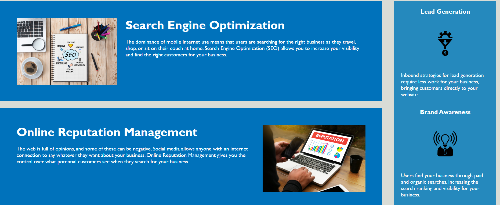

# Code-Refactor

## Table of contents

- [Overview](#overview)
 - [The challenge](#the-challenge)
  - [User Story](#user-story)
  - [Acceptance Criteria](#acceptance-criteria)
  - [Screenshot](#screenshot)
  - [Links](#links)
- [My process](#my-process)
  - [Built with](#built-with)
  - [What I learned](#what-i-learned)
- [Author](#author)


## Overview

### The challenge
This application uses a third-party API, OpenWeather One Call to access weather data. I use the fetch method with specific parameters for the API call. The data is used to build a  weather dashboard that runs in the browser and feature dynamically updated HTML and CSS using javaScript and jQuery.


### User Story

AS A marketing agency
I WANT a codebase that follows accessibility standards
SO THAT our own site is optimized for search engines

### Acceptance Criteria

GIVEN a webpage meets accessibility standards
WHEN I view the source code
THEN I find semantic HTML elements
WHEN I view the structure of the HTML elements
THEN I find that the elements follow a logical structure independent of styling and positioning
WHEN I view the image elements
THEN I find accessible alt attributes
WHEN I view the heading attributes
THEN they fall in sequential order
WHEN I view the title element
THEN I find a concise, descriptive title

### Screenshot



### Links

- Solution URL: [Code Refactor](https://github.com/Monkonjay/Code-Refactor)
- Live Site: [View the Page](https://monkonjay.github.io/Code-Refactor/)

## My process

### Built with

- CSS 
- HTML5


### What I learned

I practiced having clean code base, ensuring that the CSS is not repetitive and writing descriptive alt attributes 


```CSS
    .header div ul li {
    display: inline-block;
    margin-left: 25px;
}
```


## Author

- Website - [Robert M Greene]( https://monkonjay.github.io/Portfolio/)
- Github - [Monkonjay](https://github.com/Monkonjay)